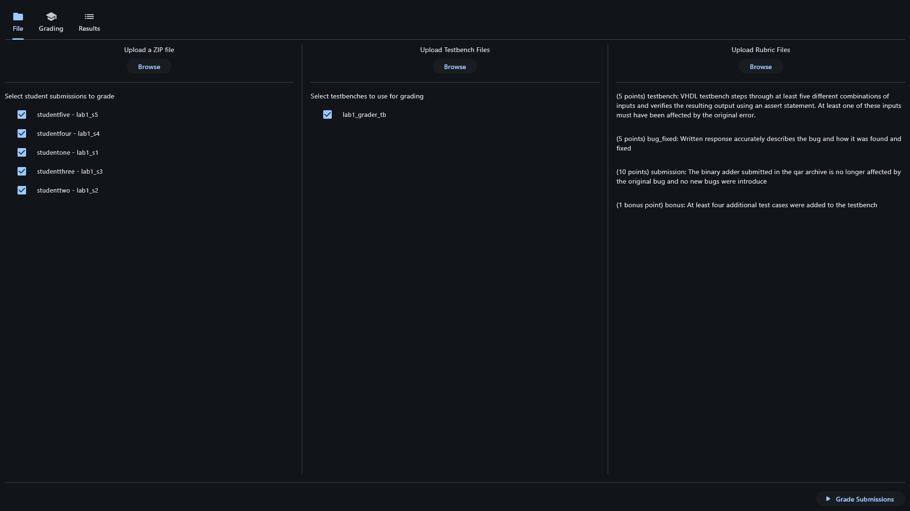
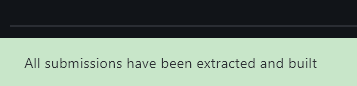
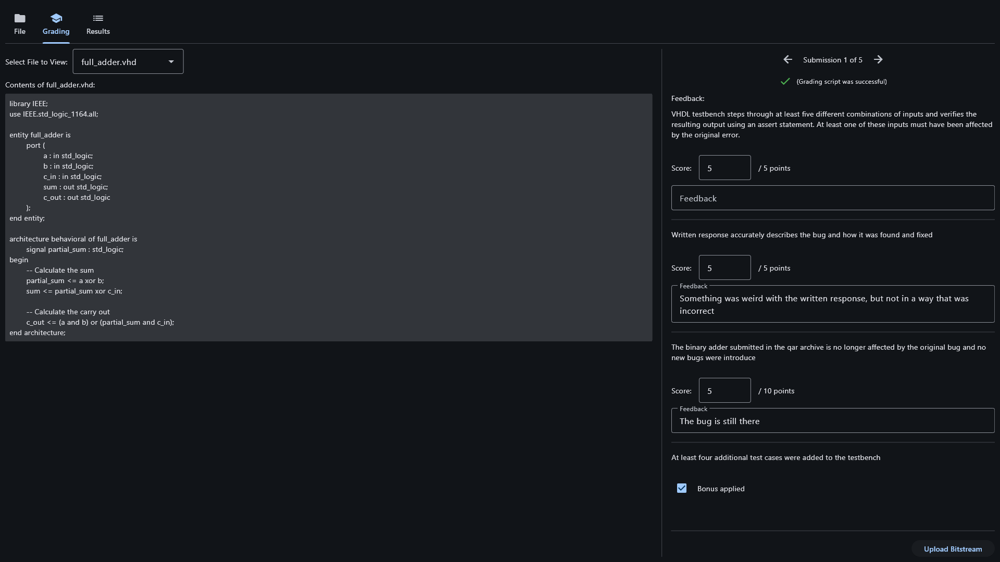
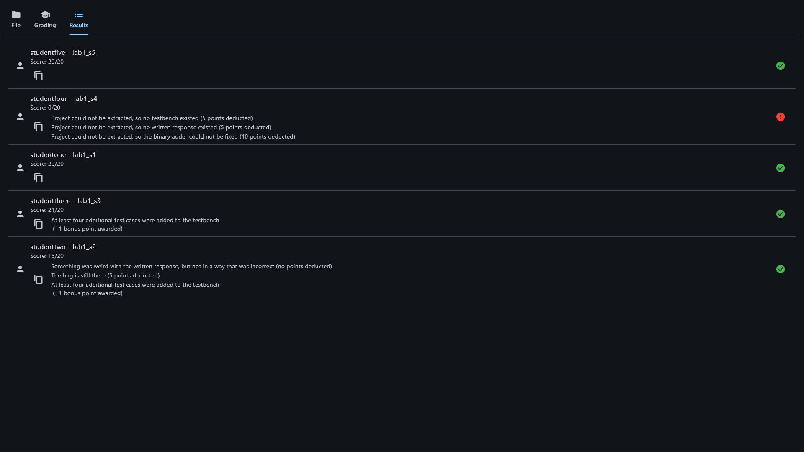

# dsd_grading
Automated grading tool for ECE 3140

This program takes the zip file supplied by Canvas with all submissions made in a given assignment, extracts the files, restores any Quartus archives, and then build each Quartus project submitted and runs the included testbench. Additional test bench files can be specified, which will also be compiled and run against the submitted design. The user can then review all of the files in each project along with the output of the testbenches and provide feedback based on a rubric. Once all of the projects have been graded, the user can simply copy paste the feedback from the results page into Canvas to provide feedback to the students.

Student submissions are anonymized and presented for grading in a random order.

## Dependencies

The following external dependencies are required to run this program:
- Quartus 25.1
- make
- ghdl

If you are running the project directly from the python source code, you will also need to install the following python packages:
- aiomultiprocess >= 0.9.1
- flet\[all\] >= 1.0.1
- lark >= 1.3.1
- platformdirs >= 4.11.14

If you would like to build the project into a standalone executable, you will also need to install pyinstaller >= 6.22.3.

For convenience, a pyproject.toml file compatible with uv can be found in the root directory of the project

## Usage

If you have uv installed, you can run the grading tool with `uv run dsd-grading`. If you don't, call the `main()` function in `src/dsd_grading/__init__.py` directly.

The grading tool will initially open to the file management view, where you can select the zip file containing the submissions to grade. This view is also where you can add any addition testbench files and where you upload the grading rubric. Once you have selected all of the files, click the "Begin Grading" button to start the grading process. The grading tool will then extract all of the submissions, restore any Quartus archives, and build each project. Once all of the projects have been built, a notification will appear on the bottom of the window

Once the build is complete, switch to the grading tab. In the grading tab, you can step through all of the submissions, view the extracted files and the output of the testbenches, upload the bitstream to an FPGA, and provide feedback based on the rubric.

Finally, once all the submissions have been graded, switch to the results tab. The results tab will show a list of all students submissions along with the grade and feedback you provided for each submission. You can copy the feedback for any given submission by clicking on the copy icon to the left of the feedback text box.

